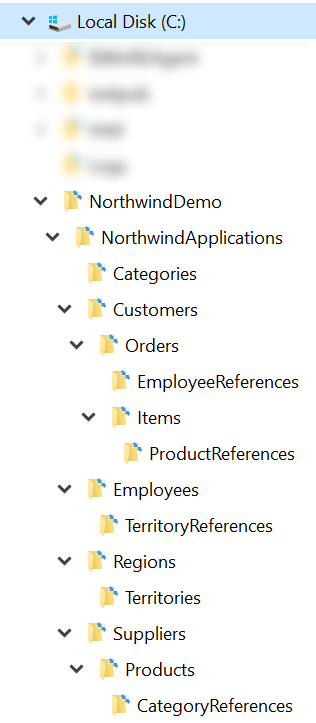
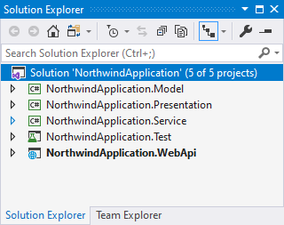
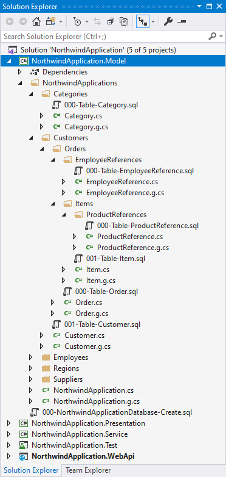
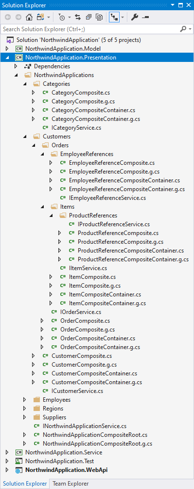



CTLite automatically generates .NET Core applications, SQL databases, and APIs from a **code-free domain model**. CTLite outputs a complete, ready-to-run code solution that implements a layered Presentation Model/Model-View-ViewModel architecture. Use (and reuse!) CTLite code with ASP.NET Core, Windows Presentation Foundation, Xamarin.Forms, Windows Forms, console applications, and more.

CTLite offers:

* Developer productivity - automates and standardizes the application's architecture
* "API-first" development - enables maximum code reuse
* Domain-based code organization - keeps the code focused on functional domain requirements.
* Low dependency, small code library - includes an integrated database object-relational mapper, dependency injection system, and SQL DDL management support   

# Domain Model
CTLite domain models are specified using **ordinary, empty directories on your disk**. The directories' and sub-directories' names establish the class names and the one-to-many relationships of the classes in the domain model. The example domain model below is based on Microsoft's "Northwind" sample database, a fictitious e-commerce company:



CTLite requires domain model directory names to be English **plural nouns** - specifically nouns ending in "*s*", "*es*", or "*ies*". **This naming convention controls CTLite's novel code generation process**.

CTLite domain models begin with a **root directory** that represents the outermost boundary of your system-under-design (ex. an application, microservice, library, etc.). In our Northwind example, we choose the name "NorthwindApplications" to represent an application for the Northwind organization, following CTLite's rule for plural domain model directory names. 

**All relationships in CTLite domain models are one-to-many**. A directory represents a class in the domain model, and the directory's sub-directories define child classes. One-to-one relationships (a special case of a one-to-many relationship) and many-to-many relationships (implemented as one-to-many reference/link classes) are both modeled in similar fashion. In the Northwind example, a *Customer* has *Orders*, an *Order* has *Items*, and an *Item* references a *Product* (where an *Item* has a single *ProductReference*).  

> Successful domain modeling should be an iterative, collaborative effort between domain experts and all the stakeholders of your project. A well-modeled domain that holistically considers all system use cases, integrations, and reporting requirements makes for a system that evolves gracefully over its lifetime.  

# Code Generation
CTLite includes a command-line utility called **CTGen**. CTGen creates and refreshes C# code from the domain model. CTGen may also run generated SQL scripts. Code solutions generated by CTGen contain:

* Visual Studio solution file (.sln)
* Model Project
* Presentation Project
* Service Project
* Test Project
* SQL DDL scripts
* Application project
  * ASP.NET Core API
  * (others to come!)

## CTGen
Syntax for CTGen follows:
```
CTGen Usage

-r : root directory of domain model
-a : application type to generate (ex. webapi)
-p : generate solution file (.sln) and projects (.csproj)
-c : generate code (.cs)
-cd : generate code sample docs
-cc : generate composite (presentation) sample "Create" method
-cr : generate composite (presentation) sample "Remove" method
-csvc : generate service (interfaces and classes) samples
-sc : generate sql scripts
-sr : run sql scripts
-srcdb : run database create script (WARNING: DEFAULT SCRIPT DELETES ANY EXISTING DATABASE)
-mcs : master db connection string
-dbcs : application db connection string
```

Example:
Generate code solution for the domain model in ```C:\NorthwindDemo\NorthwindApplications``` which includes:
* An ASP.NET Core API Project: ```-a webapi```
* C#/SQL code (Model, Presentation, Service, Test): ```-c```
* Projects (Model, Presentation, Service, Test): ```-p```
* Commented-out in-line C# code samples: ```-cd```
* Sample "Create" factory method on Presentation composite container classes: ```-cc```
* Sample "Remove" factory method on Presentation composite classes: ```- cr```
* Sample service interfaces and class: ```-csvc```
* SQL DDL scripts for creating tables for Model classes including foreign key relationships: ```-sc```
* Running all SQL scripts (files with .sql in domain model directory and subdirectories): ```-sr```
* Running the CREATE DATABASE SQL script from the Master DB: ```-srcdb```  

```
CTGen -r "C:\NorthwindDemo\NorthwindApplications" -a webapi -c -p -cd -cc -cr -csvc -sc -sr -srcdb -mcs "Data Source=(LocalDb)\MSSQLLocalDB;Initial Catalog=master;Integrated Security=SSPI;" -dbcs "Data Source=(LocalDb)\MSSQLLocalDB;Integrated Security=SSPI;"
```
## Visual Studio Solution
After code generation is complete, the CTGen generated solution file can be opened in Visual Studio.



## Model Project
The **Model Project** represents the base data structures of the domain model. CTGen creates C# (POCO) classes based on the directory names of the domain model, converting the plural directory name to a singular name for the class. CTGen preserves the domain model's directory structure in the generated code. CTLite model classes are intended to be serializable/deserializable.

Class files with a ```.g.cs``` extension are generated/refreshed each time CTGen is run (with the ```-c``` option), and ```.cs``` files are generated once and are editable by the developer. The ```.g.cs``` files contain boilerplate code that supports CTLite's internal functionality. The ```.cs``` files should contain any properties and methods as required and implemented by the developer.

The generated model classes are C# partial classes that implement the **Composite** design pattern. The generated portion of the model class contains:
* A property named ```Id``` which serves as the class object's unique identifier
* A property named ```[ParentClassName]Id``` where ```[ParentClassName]``` is the name of the parent class (if a parent class exists), which contains the ```Id``` property value of the parent class
* A property named ```[ParentClassName]``` referencing the parent class object (if a parent class exists) 
* Dictionaries for each child model class, with the key being the ```Id``` property value of those classes
* Factory methods for each child model class, named ```CreateNew[ModelClassName]```, where ```[ModelClassName]``` is the name of the model class
* A ```Remove``` method, which removes the model class object from its containing dictionary
* A ```[System.Runtime.Serialization.DataContractAttribute]``` class attribute on the model class to indicate that the model class is to be serialized/deserialized
* Several ```[System.Runtime.Serialization.DataMemberAttribute]``` property attributes to indicate model class properties that should be serialized/deserialized
* A ```[CTLite.ParentPropertyAttribute]``` class attribute indicating the name of the parent class property
* A ```[CTLite.KeyPropertyAttribute]``` class attribute indicating the name of the unique identifier property

> Model classes should contain data that your system stores and processes. Model classes should include property storage, data validation and processing logic only.



Per our Northwind example domain model, a model class (the *Order* class) looks like the following:

Order.g.cs 
```csharp
// -------------------------------------------------------------------------------------
// THIS FILE WAS GENERATED BY CTGEN - DO NOT EDIT THIS FILE, CHANGES WILL BE OVERWRITTEN
// EDIT THE FILE Order.cs INSTEAD
// -------------------------------------------------------------------------------------
using CTLite;
using System;
using System.Collections.Concurrent;
using System.Collections.Generic;
using System.Collections.ObjectModel;
using System.Runtime.Serialization;
using NorthwindApplication.Model.NorthwindApplications.Customers.Orders.EmployeeReferences;
using NorthwindApplication.Model.NorthwindApplications.Customers.Orders.Items;


namespace NorthwindApplication.Model.NorthwindApplications.Customers.Orders
{
	[DataContract]
	[ParentProperty(nameof(Order.Customer))]
	[KeyProperty(nameof(Order.Id), nameof(Order.OriginalId))]
	public partial class Order
	{
		[DataMember]
		public CompositeState State { get; set; } = CompositeState.Unchanged;

		[DataMember]
		public long Id { get; set; }

		public long OriginalId { get; set; }

		[DataMember] public long CustomerId { get; set;}
		public Customer Customer { get; internal set;}

		public Order() 
		{
			employeereferences = new ConcurrentDictionary<long, EmployeeReference>();
			_employeereferences = new ReadOnlyDictionary<long, EmployeeReference>(employeereferences);
			items = new ConcurrentDictionary<long, Item>();
			_items = new ReadOnlyDictionary<long, Item>(items);
		}


		internal Order(Customer customer) 
		{
			CustomerId = customer.Id;
			Customer = customer ?? throw new ArgumentNullException(nameof(customer));
			Customer.orders.Load(this, _ => { return new long().NewId(); });

			employeereferences = new ConcurrentDictionary<long, EmployeeReference>();
			_employeereferences = new ReadOnlyDictionary<long, EmployeeReference>(employeereferences);
			items = new ConcurrentDictionary<long, Item>();
			_items = new ReadOnlyDictionary<long, Item>(items);
		}


		public EmployeeReference CreateNewEmployeeReference() { return new EmployeeReference(this); }
		public Item CreateNewItem() { return new Item(this); }


		[DataMember] internal ConcurrentDictionary<long, EmployeeReference> employeereferences;
		private ReadOnlyDictionary<long, EmployeeReference> _employeereferences;
		public IReadOnlyDictionary<long, EmployeeReference> EmployeeReferences { get { return _employeereferences; } }

		[DataMember] internal ConcurrentDictionary<long, Item> items;
		private ReadOnlyDictionary<long, Item> _items;
		public IReadOnlyDictionary<long, Item> Items { get { return _items; } }


		public void Remove() { Customer.orders.TryRemove(Id, out _); }

		[OnDeserialized]
		private void OnDeserialized(StreamingContext context)
		{
			_employeereferences = new ReadOnlyDictionary<long, EmployeeReference>(employeereferences);
			_items = new ReadOnlyDictionary<long, Item>(items);
		}
	}
}
```

Order.cs
```csharp
using CTLite;
using System.Runtime.Serialization;

namespace NorthwindApplication.Model.NorthwindApplications.Customers.Orders
{
	public partial class Order
	{
		// TODO: Create your properties and methods for the 'Order' Model class here. Include [DataMember] attribute on properties to be persisted.
		// TODO: (Optional) - implement data validation logic in property setters for 'Order' Model class
		// TODO: (Optional) - Add a corresponding database column for any properties implemented for the 'Order' Model class in nnn-Table-Order.sql - ex. EXEC CreateOrModifyColumn 'Order', 'Name', 'nvarchar(50)'  
		
		// [DataMember]
		// public string Name { get; set; }
	}
}
```

## Presentation Project
The Presentation Project represents the public, external state and commands of the Model Project. Presentation classes host model classes and "present" them in an appropriate way for consumption by views. Generally speaking, a "view" is anything that hosts classes of the Presentation project, and need not be visual. CTLite.AspNetCore is one such host of Presentation classes.

The Presentation Project also defines interfaces implemented by classes in the Service Project. Calls to the dependent Service classes are made through these interfaces, whose implementation dependencies are injected upon application startup.   

> Presentation (composite) classes should contain properties and methods that expose corresponding properties and methods on model classes. Presentation classes should implement presentation/view logic, and calls to external services only.

Presentation classes are of two types: **Composite** and **Container**. A Composite class contains a model class, and exposes the model class's properties and methods. A Container class contains a dictionary which contains Composite child classes as well as factory methods for Composites in the container's dictionary, and other properties and methods.

Similar to classes in the Model Project, CTGen creates ```.g.cs``` and ```.cs``` files for Composite and Container classes.

Similar to classes in the Model Project, Presentation classes use ```[System.Runtime.Serialization.DataContractAttribute]```, ```[System.Runtime.Serialization.DataMemberAttribute]```, ```[CTLite.ParentPropertyAttribute]```, and ```[CTLite.KeyPropertyAttribute]``` to indicate serializable properties, exposed methods, unique identifier property, and parent relationship. 

Presentation class methods are decorated with CTLite's ```[CTLite.CommandAttribute]``` to activate the method for CTLite.  

The ```Composite.NotifyPropertyChanged``` method signals event subscribers of the PropertyChanged event, while also updating the ```State``` of the Composite if necessary. 

The top-level class of the Presentation Project is a **CompositeRoot** class of type ```CTLite.CompositeRoot```. All Presentation classes are connected to this class via the tree of Composite classes as defined by the domain model. The ```CompositeRoot``` is also the site where dependencies implementing CTLite's ```IService``` interface are injected.  



Per our Northwind example domain model, a Presentation ```CompositeRoot``` class (ex. the *NorthwindApplication* class) looks like the following:

NorthwindApplicationCompositeRoot.g.cs
```csharp
// -------------------------------------------------------------------------------------
// THIS FILE WAS GENERATED BY CTGEN - DO NOT EDIT THIS FILE, CHANGES WILL BE OVERWRITTEN
// EDIT THE FILE NorthwindApplicationCompositeRoot.cs INSTEAD
// -------------------------------------------------------------------------------------
using CTLite;
using System;
using System.Runtime.Serialization;
using System.Runtime.CompilerServices;
using NorthwindApplication.Presentation.NorthwindApplications.Categories;
using NorthwindApplication.Presentation.NorthwindApplications.Customers;
using NorthwindApplication.Presentation.NorthwindApplications.Employees;
using NorthwindApplication.Presentation.NorthwindApplications.Regions;
using NorthwindApplication.Presentation.NorthwindApplications.Suppliers;

[assembly: InternalsVisibleTo("NorthwindApplication.Test")]

namespace NorthwindApplication.Presentation.NorthwindApplications
{
	[DataContract]
	[CompositeModel(nameof(NorthwindApplicationCompositeRoot.NorthwindApplicationModel))]
	public partial class NorthwindApplicationCompositeRoot : CompositeRoot
	{
		public override CompositeState State { get => throw new NotImplementedException(); set => throw new NotImplementedException(); }

		internal Model.NorthwindApplications.NorthwindApplication NorthwindApplicationModel; 

		public NorthwindApplicationCompositeRoot() : base() { Initialize(); }
		public NorthwindApplicationCompositeRoot(params IService[] services) : base(services) { Initialize(); }

		public override long Id => NorthwindApplicationModel.Id;

		private void Initialize()
		{
			NorthwindApplicationModel = new Model.NorthwindApplications.NorthwindApplication();
			Categories = new CategoryCompositeContainer(this);
			Customers = new CustomerCompositeContainer(this);
			Employees = new EmployeeCompositeContainer(this);
			Regions = new RegionCompositeContainer(this);
			Suppliers = new SupplierCompositeContainer(this);
		}

		public override void InitializeCompositeModel(object model)
		{
			NorthwindApplicationModel = model as Model.NorthwindApplications.NorthwindApplication;
			Categories = new CategoryCompositeContainer(this);
			Customers = new CustomerCompositeContainer(this);
			Employees = new EmployeeCompositeContainer(this);
			Regions = new RegionCompositeContainer(this);
			Suppliers = new SupplierCompositeContainer(this);
		}

		[DataMember] public CategoryCompositeContainer Categories { get; private set; }
		[DataMember] public CustomerCompositeContainer Customers { get; private set; }
		[DataMember] public EmployeeCompositeContainer Employees { get; private set; }
		[DataMember] public RegionCompositeContainer Regions { get; private set; }
		[DataMember] public SupplierCompositeContainer Suppliers { get; private set; }
	}
}
```

NorthwindApplicationCompositeRoot.cs
```csharp
using CTLite;
using System;
using System.IO;
using System.Runtime.Serialization;

namespace NorthwindApplication.Presentation.NorthwindApplications
{
	public partial class NorthwindApplicationCompositeRoot
	{
	}
}
```

Per our Northwind example domain model, a Presentation class (ex. the *Order* class) looks like the following:

OrderComposite.g.cs
```csharp
// -------------------------------------------------------------------------------------
// THIS FILE WAS GENERATED BY CTGEN - DO NOT EDIT THIS FILE, CHANGES WILL BE OVERWRITTEN
// EDIT THE FILE OrderComposite.cs INSTEAD
// -------------------------------------------------------------------------------------
using CTLite;
using System;
using System.Runtime.Serialization;
using System.Runtime.CompilerServices;
using NorthwindApplication.Presentation.NorthwindApplications.Customers.Orders.EmployeeReferences;
using NorthwindApplication.Presentation.NorthwindApplications.Customers.Orders.Items;
using NorthwindApplication.Model.NorthwindApplications.Customers.Orders;

namespace NorthwindApplication.Presentation.NorthwindApplications.Customers.Orders
{
	[DataContract]
	[ParentProperty(nameof(OrderComposite.Orders))]
	[KeyProperty(nameof(OrderComposite.Id), nameof(OrderComposite.OriginalId))]
	[CompositeModel(nameof(OrderComposite.OrderModel))]
	public partial class OrderComposite : Composite
	{
		public override CompositeState State { get => OrderModel.State; set => OrderModel.State = value; }

		internal Order OrderModel; 

		public OrderCompositeContainer Orders { get; }

		internal OrderComposite(Order order, OrderCompositeContainer orderCompositeContainer ) 
		{ 
			OrderModel = order; Orders = orderCompositeContainer;
			EmployeeReferences = new EmployeeReferenceCompositeContainer(this);
			Items = new ItemCompositeContainer(this);
		}

		[DataMember] public long Id { get { return OrderModel.Id; } }

		public long OriginalId { get { return OrderModel.OriginalId; } }

		[Command] public void Remove() { Orders.orders.Remove(Id, true); }

		[DataMember] public EmployeeReferenceCompositeContainer EmployeeReferences { get; private set; }
		[DataMember] public ItemCompositeContainer Items { get; private set; }
	}
}
```

OrderComposite.cs
```csharp
using CTLite;
using System;
using System.IO;
using System.Runtime.Serialization;

namespace NorthwindApplication.Presentation.NorthwindApplications.Customers.Orders
{
	public partial class OrderComposite
	{
	}
}
```

OrderCompositeContainer.g.cs
```csharp
// -------------------------------------------------------------------------------------
// THIS FILE WAS GENERATED BY CTGEN - DO NOT EDIT THIS FILE, CHANGES WILL BE OVERWRITTEN
// EDIT THE FILE OrderCompositeContainer.cs INSTEAD
// -------------------------------------------------------------------------------------
using CTLite;
using System;
using System.Runtime.Serialization;
using NorthwindApplication.Model.NorthwindApplications.Customers.Orders;

namespace NorthwindApplication.Presentation.NorthwindApplications.Customers.Orders
{
	[DataContract]
	[ParentProperty(nameof(OrderCompositeContainer.Customer))]
	[CompositeContainer(nameof(OrderCompositeContainer.Orders), nameof(OrderCompositeContainer.Orders), nameof(OrderCompositeContainer.orders))]
	public partial class OrderCompositeContainer : Composite
	{
		public override CompositeState State { get => throw new NotImplementedException(); set => throw new NotImplementedException(); }

		public CustomerComposite Customer { get; private set; }

		internal OrderCompositeContainer(CustomerComposite customerComposite)
		{
			this.InitializeCompositeContainer(out orders, customerComposite);
			_newOrderFunc = () => Customer.CustomerModel.CreateNewOrder();
		}

		private readonly Func<Order> _newOrderFunc;

		[NonSerialized]
		internal CompositeDictionary<long, OrderComposite> orders;
		[DataMember]
		public ReadOnlyCompositeDictionary<long, OrderComposite> Orders { get; private set; }
	}
}
```

OrderCompositeContainer.cs
```csharp
using CTLite;
using CTLite.Data.MicrosoftSqlServer;
using System.Linq;

namespace NorthwindApplication.Presentation.NorthwindApplications.Customers.Orders
{
	public partial class OrderCompositeContainer
	{
		// * This is a sample factory method for creating new instances of OrderComposite and adding the newly created instance to the OrderCompositeContainer dictionary
		// * Methods exposed to CTLite must include the [Command] attribute
		// * Use the _newOrderFunc delegate to create new instances of the Order for passing into the OrderComposite constructor
		// * Setting the State property to CompositeState.New indicates that newOrder should be inserted to the database when using CTLite.Data API  
		[Command]
		public OrderComposite CreateNewOrder()
		{
			var newOrder = new OrderComposite(_newOrderFunc.Invoke(), this) { State = CompositeState.New };
			orders.Add(newOrder.Id, newOrder);
			return newOrder;
		}
	}
}
```

## Service Project
TODO

## Test Project
TODO 

## SQL DDL Scripts
CTGen will generate **SQL DDL Scripts** in the Model Project when the ```-sc``` option is specified. The filename generated is ```[NNN]-Table-[ModelClassName]```, where ```[NNN]``` is a sequential number, and ```[ModelClassName]``` is the name of the model class. 

CTGen runs SQL scripts contained in the root directory and its subdirectory with the ```-sr``` option. GTGen runs SQL scripts recursively starting from the root directory, running each sub-directory's scripts in ascending filename order.

GTGen generates a ```CREATE DATABASE`` script as part of the Model Project SQL script generation. The script drops the existing database, and re-creates the database. **DO NOT** invoke the ```-srcdb``` option unless you wish to delete the database and all its data.

# CTLite NuGet Packages
CTLite consists of several packages to support application/services development of several varieties.


## CTLite
CTLite has a core package **CTLite.dll**, which contains functionality to support the CTLite infrastructure and some classes/types to support building out CTLite applications and services.

## CTLite.Data.MicrosoftSqlServer
**CTLite.Data.MicrosoftSqlServer.dll** implements specific Microsoft SQL Server functionality to support CTLite's object-relational mapper implemented in the **CTLite.Data** namespace. 

## CTLite.AspNetCore
**CTLite.AspNetCore** provides support for hosting the CTLite Presentation Project as an ASP.NET Core *front API controller*.