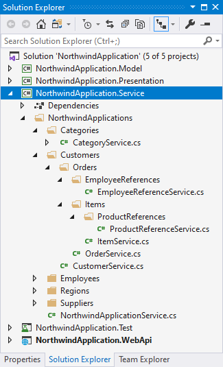
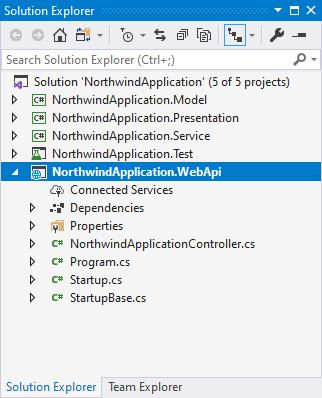
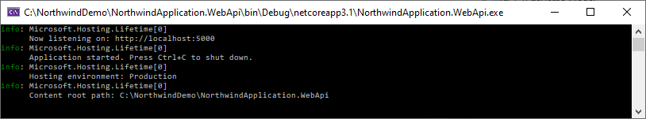



* [Introduction](#Introduction)
* [Domain Model](#Domain-Model)
* [Code Generation](#Code-Generation)
  * [CTGen](#CTGen)
  * [Visual Studio Solution](#Visual-Studio-Solution)
    * [Model Project](#Model-Project)
    * [Presentation Project](#Presentation-Project)
      * [CTLite.AspNetCore - Presentation class methods](#CTLite.AspNetCore-Presentation-class-methods)
    * [Service Project](#Service-Project)
    * [Test Project](#Test-Project)
    * [SQL DDL Scripts](#SQL-DDL-Scripts)
* [CTLite Nuget packages](#CTLite-Nuget-packages)
  * [CTLite](#CTLite)
  * [CTLite.Data.MicrosoftSqlServer](#CTLite.Data.MicrosoftSqlServer)
    * [Tracking Composite object changes](#Tracking-Composite-object-changes)
    * [Loading Composites from the database](#Loading-Composites-from-the-database)
    * [Saving Composites to the database](#Saving-Composites-to-the-database)
    * [NoDbAttribute](#NoDbAttribute)
  * [CTLite.AspNetCore](#CTLite.AspNetCore)
    * [CompositeRootControllerBase](#CompositeRootControllerBase)
    * [Service class dependency injection](#Service-class-dependency-injection)
    * [Running the WebApi project](#Running-the-WebApi-project)
    * [Calling Properties and Methods](#Calling-Properties-and-Methods)
      * [Calling Methods](#Calling-methods)
      * [Calling Properties](#Calling-properties)
      * [Accessing dictionary Composites](#Accessing-dictionary-Composites)
      * [Multiple Commands](#Multiple-Commands)
      * [Command Help](#Command-Help)

# Introduction
CTLite automatically generates .NET Core applications, SQL databases, and APIs from a **code-free domain model**. CTLite outputs a complete, ready-to-run code solution that implements a layered Presentation Model/Model-View-ViewModel architecture. Use (and reuse!) CTLite code with ASP.NET Core, Windows Presentation Foundation, Xamarin.Forms, Windows Forms, console applications, and more.

CTLite offers:

* Developer productivity - automates and standardizes the application's architecture
* "API-first" development - enables maximum code reuse  
* Domain-based code organization - keeps the code focused on functional domain requirements.
* Low dependency, small code library - includes an integrated database object-relational mapper, dependency injection system, and SQL DDL management support   


# Domain Model
CTLite **Domain Models** are specified using **ordinary, empty directories on your disk**. The directories' and sub-directories' names establish the class names and the one-to-many relationships of the classes in the Domain Model. The example Domain Model below is based on Microsoft's "Northwind" sample database, a fictitious e-commerce company:


CTLite requires Domain Model directory names to be English **plural nouns** - specifically nouns ending in "*s*", "*es*", or "*ies*". **This naming convention controls CTLite's novel code generation process**.

CTLite Domain Models begin with a **root directory** that represents the outermost boundary of your system-under-design (ex. an application, microservice, library, etc.). Per our Northwind example, we choose the name "NorthwindApplications" to represent an application for the Northwind organization, following CTLite's rule for plural domain model directory names. 

**All relationships in CTLite domain models are one-to-many**. A directory represents a class in the domain model, and the directory's sub-directories define child classes. One-to-one relationships (a special case of a one-to-many relationship) and many-to-many relationships (implemented as one-to-many reference/link classes) are both modeled in similar fashion. In the Northwind example, a *Customer* has *Orders*, an *Order* has *Items*, and an *Item* references a *Product* (where an *Item* has a single *ProductReference*).  

> Successful domain modeling should be an iterative, collaborative effort between domain experts and all the stakeholders of your project. A well-modeled domain that holistically considers all system use cases, integrations, and reporting requirements makes for a system that evolves gracefully over its lifetime.  

# Code Generation
CTLite includes a command-line utility called **CTGen**. CTGen creates and refreshes C# code from the domain model. CTGen may also run generated SQL scripts. Code solutions generated by CTGen contain:

* Visual Studio solution file (.sln)
* Model Project
* Presentation Project
* Service Project
* Test Project
* SQL DDL scripts
* Application project
  * ASP.NET Core API
  * (others to come!)

## CTGen
> [Download the latest build of CTGen](https://github.com/compositactic/CTLiteDemo/raw/master/CTLite.Tools.CTGen/CTGen.zip) - [Requires .NET Core 3.1](https://dotnet.microsoft.com/download/dotnet-core/3.1)

Syntax for CTGen follows:
```
CTGen Usage

-r : root directory of domain model
-a : application type to generate (ex. webapi)
-p : generate solution file (.sln) and projects (.csproj)
-c : generate code (.cs)
-cd : generate code sample docs
-cc : generate composite (presentation) sample "Create" method
-cr : generate composite (presentation) sample "Remove" method
-csvc : generate service (interfaces and classes) samples
-sc : generate sql scripts
-sr : run sql scripts
-srcdb : run database create script (WARNING: DEFAULT SCRIPT DELETES ANY EXISTING DATABASE)
-mcs : master db connection string
-dbcs : application db connection string
```

Example:
Generate code solution for the domain model in ```C:\NorthwindDemo\NorthwindApplications``` which includes:
* An ASP.NET Core API Project: ```-a webapi```
* C#/SQL code (Model, Presentation, Service, Test): ```-c```
* Projects (Model, Presentation, Service, Test): ```-p```
* Commented-out in-line C# code samples: ```-cd```
* Sample "Create" factory method on Presentation composite container classes: ```-cc```
* Sample "Remove" factory method on Presentation composite classes: ```- cr```
* Sample service interfaces and class: ```-csvc```
* SQL DDL scripts for creating tables for Model classes including foreign key relationships: ```-sc```
* Running all SQL scripts (files with .sql in domain model directory and subdirectories): ```-sr```
* Running the CREATE DATABASE SQL script from the Master DB: ```-srcdb```  

```
CTGen -r "C:\NorthwindDemo\NorthwindApplications" -a webapi -c -p -cd -cc -cr -csvc -sc -sr -srcdb -mcs "Data Source=(LocalDb)\MSSQLLocalDB;Initial Catalog=master;Integrated Security=SSPI;" -dbcs "Data Source=(LocalDb)\MSSQLLocalDB;Integrated Security=SSPI;"
```
## Visual Studio Solution
After code generation is complete, the CTGen generated solution file can be opened in Visual Studio.


### Model Project
The **Model Project** represents the base data structures of the Domain Model. CTGen creates C# (POCO) classes based on the directory names of the Domain Model, converting the plural directory name to a singular name for the class. CTGen preserves the Domain Model's directory structure in the generated code. CTLite **Model Classes** are intended to be serializable/deserializable.

Class files with a ```.g.cs``` extension are generated/refreshed each time CTGen is run (with the ```-c``` option), and ```.cs``` files are generated once and are editable by the developer. The ```.g.cs``` files contain boilerplate code that supports CTLite's internal functionality. The ```.cs``` files should contain any properties and methods as required and implemented by the developer.

The generated Model Classes are C# partial classes that implement the **Composite** design pattern. The generated portion of the Model Class contains:
* A property named ```Id``` which serves as the class object's unique identifier
* A property named ```[ParentClassName]Id``` where ```[ParentClassName]``` is the name of the parent class (if a parent class exists), which contains the ```Id``` property value of the parent class
* A property named ```[ParentClassName]``` referencing the parent class object (if a parent class exists) 
* Dictionaries for each child model class, with the key being the ```Id``` property value of those classes
* Factory methods for each child model class, named ```CreateNew[ModelClassName]```, where ```[ModelClassName]``` is the name of the model class
* A ```Remove``` method, which removes the model class object from its containing dictionary
* A ```[System.Runtime.Serialization.DataContractAttribute]``` class attribute on the model class to indicate that the model class is to be serialized/deserialized
* Several ```[System.Runtime.Serialization.DataMemberAttribute]``` property attributes to indicate model class properties that should be serialized/deserialized
* A ```[CTLite.ParentPropertyAttribute]``` class attribute indicating the name of the parent class property
* A ```[CTLite.KeyPropertyAttribute]``` class attribute indicating the name of the unique identifier property

> Model Classes should contain data that your system stores and processes. Model classes should include property storage, data validation and processing logic only.


Per our Northwind example Domain Model, a Model Class (the *Order* class) looks like the following:

Order.g.cs 
```csharp
// -------------------------------------------------------------------------------------
// THIS FILE WAS GENERATED BY CTGEN - DO NOT EDIT THIS FILE, CHANGES WILL BE OVERWRITTEN
// EDIT THE FILE Order.cs INSTEAD
// -------------------------------------------------------------------------------------
using CTLite;
using System;
using System.Collections.Concurrent;
using System.Collections.Generic;
using System.Collections.ObjectModel;
using System.Runtime.Serialization;
using NorthwindApplication.Model.NorthwindApplications.Customers.Orders.EmployeeReferences;
using NorthwindApplication.Model.NorthwindApplications.Customers.Orders.Items;


namespace NorthwindApplication.Model.NorthwindApplications.Customers.Orders
{
	[DataContract]
	[ParentProperty(nameof(Order.Customer))]
	[KeyProperty(nameof(Order.Id), nameof(Order.OriginalId))]
	public partial class Order
	{
		[DataMember]
		public CompositeState State { get; set; } = CompositeState.Unchanged;

		[DataMember]
		public long Id { get; set; }

		public long OriginalId { get; set; }

		[DataMember] public long CustomerId { get; set;}
		public Customer Customer { get; internal set;}

		public Order() 
		{
			employeereferences = new ConcurrentDictionary<long, EmployeeReference>();
			_employeereferences = new ReadOnlyDictionary<long, EmployeeReference>(employeereferences);
			items = new ConcurrentDictionary<long, Item>();
			_items = new ReadOnlyDictionary<long, Item>(items);
		}


		internal Order(Customer customer) 
		{
			CustomerId = customer.Id;
			Customer = customer ?? throw new ArgumentNullException(nameof(customer));
			Customer.orders.Load(this, _ => { return new long().NewId(); });

			employeereferences = new ConcurrentDictionary<long, EmployeeReference>();
			_employeereferences = new ReadOnlyDictionary<long, EmployeeReference>(employeereferences);
			items = new ConcurrentDictionary<long, Item>();
			_items = new ReadOnlyDictionary<long, Item>(items);
		}


		public EmployeeReference CreateNewEmployeeReference() { return new EmployeeReference(this); }
		public Item CreateNewItem() { return new Item(this); }


		[DataMember] internal ConcurrentDictionary<long, EmployeeReference> employeereferences;
		private ReadOnlyDictionary<long, EmployeeReference> _employeereferences;
		public IReadOnlyDictionary<long, EmployeeReference> EmployeeReferences { get { return _employeereferences; } }

		[DataMember] internal ConcurrentDictionary<long, Item> items;
		private ReadOnlyDictionary<long, Item> _items;
		public IReadOnlyDictionary<long, Item> Items { get { return _items; } }


		public void Remove() { Customer.orders.TryRemove(Id, out _); }

		[OnDeserialized]
		private void OnDeserialized(StreamingContext context)
		{
			_employeereferences = new ReadOnlyDictionary<long, EmployeeReference>(employeereferences);
			_items = new ReadOnlyDictionary<long, Item>(items);
		}
	}
}
```

Order.cs
```csharp
using CTLite;
using System.Runtime.Serialization;

namespace NorthwindApplication.Model.NorthwindApplications.Customers.Orders
{
	public partial class Order
	{
		// TODO: Create your properties and methods for the 'Order' Model class here. Include [DataMember] attribute on properties to be persisted.
		// TODO: (Optional) - implement data validation logic in property setters for 'Order' Model class
		// TODO: (Optional) - Add a corresponding database column for any properties implemented for the 'Order' Model class in nnn-Table-Order.sql - ex. EXEC CreateOrModifyColumn 'Order', 'Name', 'nvarchar(50)'  
		
		// [DataMember]
		// public string Name { get; set; }
	}
}
```

### Presentation Project
The **Presentation Project** represents the public, external state and commands of the Model Project. **Presentation Classes** host model classes and "present" them in an appropriate way for consumption by views. Generally speaking, a "view" is anything that hosts classes of the Presentation Project, and need not be visual. CTLite.AspNetCore is one such host of Presentation Classes.

The Presentation Project also defines **Service Interfaces** (implementing the ```CTLite.IService```) implemented by **Service Classes** in the Service Project. Calls to the dependent Service Classes are made through these Service Interfaces, whose implementation dependencies are injected upon application startup. CTGen will output commented-out ```IService``` interface definitions as samples to follow when defining your own ```CTLite.IService``` interfaces.   

> Presentation Classes should contain properties and methods that expose corresponding properties and methods on Model Classes. Presentation Classes should implement presentation/view logic, and calls to Service Interfaces.

Presentation Classes are of two types: **Composite** and **Container**:

* A Composite Class contains a Model Class, and exposes the Model Class's properties and methods. 
* A Container Class contains a dictionary which contains child Composite Classes as well as factory methods for Composites Classes in the container's dictionary, and other properties and methods.

Similar to classes in the Model Project, CTGen creates ```.g.cs``` and ```.cs``` files for Composite and Container Classes.

Similar to classes in the Model Project, Presentation Classes use ```[System.Runtime.Serialization.DataContractAttribute]```, ```[System.Runtime.Serialization.DataMemberAttribute]```, ```[CTLite.ParentPropertyAttribute]```, and ```[CTLite.KeyPropertyAttribute]``` to indicate serializable properties, exposed methods, unique identifier property, and parent relationship. 

Presentation Class methods are decorated with CTLite's ```[CTLite.CommandAttribute]``` to activate the method for CTLite.  

The ```Composite.NotifyPropertyChanged``` method signals event subscribers of the ```PropertyChanged event```, while also updating the ```State``` of the Composite if necessary. 

The top-level class of the Presentation Project is a **CompositeRoot** Class of type ```CTLite.CompositeRoot```. All Presentation Classes are connected to this class via the tree of Composite Classes as defined by the Domain Model. The ```CompositeRoot``` is also the site where dependencies implementing CTLite's ```IService``` interface are injected.  


Per our Northwind example domain model, a Presentation ```CompositeRoot``` class (ex. the *NorthwindApplication* class) looks like the following:

NorthwindApplicationCompositeRoot.g.cs
```csharp
// -------------------------------------------------------------------------------------
// THIS FILE WAS GENERATED BY CTGEN - DO NOT EDIT THIS FILE, CHANGES WILL BE OVERWRITTEN
// EDIT THE FILE NorthwindApplicationCompositeRoot.cs INSTEAD
// -------------------------------------------------------------------------------------
using CTLite;
using System;
using System.Runtime.Serialization;
using System.Runtime.CompilerServices;
using NorthwindApplication.Presentation.NorthwindApplications.Categories;
using NorthwindApplication.Presentation.NorthwindApplications.Customers;
using NorthwindApplication.Presentation.NorthwindApplications.Employees;
using NorthwindApplication.Presentation.NorthwindApplications.Regions;
using NorthwindApplication.Presentation.NorthwindApplications.Suppliers;

[assembly: InternalsVisibleTo("NorthwindApplication.Test")]

namespace NorthwindApplication.Presentation.NorthwindApplications
{
	[DataContract]
	[CompositeModel(nameof(NorthwindApplicationCompositeRoot.NorthwindApplicationModel))]
	public partial class NorthwindApplicationCompositeRoot : CompositeRoot
	{
		public override CompositeState State { get => throw new NotImplementedException(); set => throw new NotImplementedException(); }

		internal Model.NorthwindApplications.NorthwindApplication NorthwindApplicationModel; 

		public NorthwindApplicationCompositeRoot() : base() { Initialize(); }
		public NorthwindApplicationCompositeRoot(params IService[] services) : base(services) { Initialize(); }

		public override long Id => NorthwindApplicationModel.Id;

		private void Initialize()
		{
			NorthwindApplicationModel = new Model.NorthwindApplications.NorthwindApplication();
			Categories = new CategoryCompositeContainer(this);
			Customers = new CustomerCompositeContainer(this);
			Employees = new EmployeeCompositeContainer(this);
			Regions = new RegionCompositeContainer(this);
			Suppliers = new SupplierCompositeContainer(this);
		}

		public override void InitializeCompositeModel(object model)
		{
			NorthwindApplicationModel = model as Model.NorthwindApplications.NorthwindApplication;
			Categories = new CategoryCompositeContainer(this);
			Customers = new CustomerCompositeContainer(this);
			Employees = new EmployeeCompositeContainer(this);
			Regions = new RegionCompositeContainer(this);
			Suppliers = new SupplierCompositeContainer(this);
		}

		[DataMember] public CategoryCompositeContainer Categories { get; private set; }
		[DataMember] public CustomerCompositeContainer Customers { get; private set; }
		[DataMember] public EmployeeCompositeContainer Employees { get; private set; }
		[DataMember] public RegionCompositeContainer Regions { get; private set; }
		[DataMember] public SupplierCompositeContainer Suppliers { get; private set; }
	}
}
```

NorthwindApplicationCompositeRoot.cs
```csharp
using CTLite;
using System;
using System.IO;
using System.Runtime.Serialization;

namespace NorthwindApplication.Presentation.NorthwindApplications
{
	public partial class NorthwindApplicationCompositeRoot
	{
	}
}
```

Per our Northwind example domain model, a Presentation class (ex. the *Order* class) looks like the following:

OrderComposite.g.cs
```csharp
// -------------------------------------------------------------------------------------
// THIS FILE WAS GENERATED BY CTGEN - DO NOT EDIT THIS FILE, CHANGES WILL BE OVERWRITTEN
// EDIT THE FILE OrderComposite.cs INSTEAD
// -------------------------------------------------------------------------------------
using CTLite;
using System;
using System.Runtime.Serialization;
using System.Runtime.CompilerServices;
using NorthwindApplication.Presentation.NorthwindApplications.Customers.Orders.EmployeeReferences;
using NorthwindApplication.Presentation.NorthwindApplications.Customers.Orders.Items;
using NorthwindApplication.Model.NorthwindApplications.Customers.Orders;

namespace NorthwindApplication.Presentation.NorthwindApplications.Customers.Orders
{
	[DataContract]
	[ParentProperty(nameof(OrderComposite.Orders))]
	[KeyProperty(nameof(OrderComposite.Id), nameof(OrderComposite.OriginalId))]
	[CompositeModel(nameof(OrderComposite.OrderModel))]
	public partial class OrderComposite : Composite
	{
		public override CompositeState State { get => OrderModel.State; set => OrderModel.State = value; }

		internal Order OrderModel; 

		public OrderCompositeContainer Orders { get; }

		internal OrderComposite(Order order, OrderCompositeContainer orderCompositeContainer ) 
		{ 
			OrderModel = order; Orders = orderCompositeContainer;
			EmployeeReferences = new EmployeeReferenceCompositeContainer(this);
			Items = new ItemCompositeContainer(this);
		}

		[DataMember] public long Id { get { return OrderModel.Id; } }

		public long OriginalId { get { return OrderModel.OriginalId; } }

		[Command] public void Remove() { Orders.orders.Remove(Id, true); }

		[DataMember] public EmployeeReferenceCompositeContainer EmployeeReferences { get; private set; }
		[DataMember] public ItemCompositeContainer Items { get; private set; }
	}
}
```

OrderComposite.cs
```csharp
using CTLite;
using System;
using System.IO;
using System.Runtime.Serialization;

namespace NorthwindApplication.Presentation.NorthwindApplications.Customers.Orders
{
	public partial class OrderComposite
	{
	}
}
```

OrderCompositeContainer.g.cs
```csharp
// -------------------------------------------------------------------------------------
// THIS FILE WAS GENERATED BY CTGEN - DO NOT EDIT THIS FILE, CHANGES WILL BE OVERWRITTEN
// EDIT THE FILE OrderCompositeContainer.cs INSTEAD
// -------------------------------------------------------------------------------------
using CTLite;
using System;
using System.Runtime.Serialization;
using NorthwindApplication.Model.NorthwindApplications.Customers.Orders;

namespace NorthwindApplication.Presentation.NorthwindApplications.Customers.Orders
{
	[DataContract]
	[ParentProperty(nameof(OrderCompositeContainer.Customer))]
	[CompositeContainer(nameof(OrderCompositeContainer.Orders), nameof(OrderCompositeContainer.Orders), nameof(OrderCompositeContainer.orders))]
	public partial class OrderCompositeContainer : Composite
	{
		public override CompositeState State { get => throw new NotImplementedException(); set => throw new NotImplementedException(); }

		public CustomerComposite Customer { get; private set; }

		internal OrderCompositeContainer(CustomerComposite customerComposite)
		{
			this.InitializeCompositeContainer(out orders, customerComposite);
			_newOrderFunc = () => Customer.CustomerModel.CreateNewOrder();
		}

		private readonly Func<Order> _newOrderFunc;

		[NonSerialized]
		internal CompositeDictionary<long, OrderComposite> orders;
		[DataMember]
		public ReadOnlyCompositeDictionary<long, OrderComposite> Orders { get; private set; }
	}
}
```

OrderCompositeContainer.cs
```csharp
using CTLite;
using CTLite.Data.MicrosoftSqlServer;
using System.Linq;

namespace NorthwindApplication.Presentation.NorthwindApplications.Customers.Orders
{
	public partial class OrderCompositeContainer
	{
		// * This is a sample factory method for creating new instances of OrderComposite and adding the newly created instance to the OrderCompositeContainer dictionary
		// * Methods exposed to CTLite must include the [Command] attribute
		// * Use the _newOrderFunc delegate to create new instances of the Order for passing into the OrderComposite constructor
		// * Setting the State property to CompositeState.New indicates that newOrder should be inserted to the database when using CTLite.Data API  
		[Command]
		public OrderComposite CreateNewOrder()
		{
			var newOrder = new OrderComposite(_newOrderFunc.Invoke(), this) { State = CompositeState.New };
			orders.Add(newOrder.Id, newOrder);
			return newOrder;
		}
	}
}
```

#### CTLite.AspNetCore Presentation Class Methods
For ```CompositeRoot``` classes hosted by CTLite.AspNetCore's ```CompositeRootControllerBase```, CTLite provides access to the HTTP Request/Response associated with the method invocation.

Including a parameter in the Presentation Class method with the type ```CTLite.CompositeRootHttpContext``` provides the HTTP Request/Response data to the method.

Accessing files uploaded with the HTTP Request:
```csharp
[Command]
public void DoSomethingWithWebRequestAndResponse(CompositeRootHttpContext context, bool someOtherParameter)
{
    foreach(var uploadedFile in context.Request.UploadedFiles)    
        File.WriteAllBytes(Path.Combine(Path.GetTempPath(), uploadedFile.FileName), uploadedFile.GetContent());
}
```
Returning a binary response:
```csharp
[Command]
public byte[] GetSomeBinaryData(CompositeRootHttpContext context)
{
    context.Response.ContentType = "application/octet-stream";
    return new byte[] { 0,1,2,3 };
}
```

### Service Project
The **Service Project** implements **Service Classes** whose Service Interfaces are defined in the Presentation Project. CTGen will create commented-out, stubbed out implementations of the Presentation Project's ```IService``` interface definitions.



Per our Northwind example domain model, a Service Class (ex. the *CategoryService* class) looks like the following:

ICategoryService.cs in the Presentation Project contains an ```ICategoryService``` interface definition
```csharp
using CTLite;
using System;

namespace NorthwindApplication.Presentation.NorthwindApplications.Categories
{
    public interface ICategoryService : IService
    {
        public void DoSomething(CategoryComposite categoryComposite);
    }
}
```   
CategoryService.cs in the Service Project contains the implementation of ```ICategoryService```
```csharp
using System;
using NorthwindApplication.Presentation.NorthwindApplications.Categories;

namespace NorthwindApplication.Service.NorthwindApplications.Categories
{
    public class CategoryService : ICategoryService
    {
        public CompositeRoot CompositeRoot { get; set; }

        public void DoSomething(CategoryComposite categoryComposite)
        {
            Console.WriteLine($"Hello {categoryComposite} {categoryComposite.Id} from {nameof(CategoryService)}.{nameof(DoSomething)}");
        }
    }
}
```

CategoryComposite.cs in the Presentation Project contains a ```[CTLite.Command]```-decorated method to obtain a reference to the ```ICategoryService``` and calls the ```CategoryService```
```csharp
using CTLite;
using System;
using System.IO;
using System.Runtime.Serialization;

namespace NorthwindApplication.Presentation.NorthwindApplications.Categories
{
	public partial class CategoryComposite
	{
		[Command]
		public void CallCategoryService()
		{
			var categoryService = CompositeRoot.GetService<ICategoryService>();
			categoryService.DoSomething(this);
		}
	}
}
```

### Test Project
CTGen creates a stub Test Project where automated tests can be written that run the Model Project code and/or Presentation Project code. An example test appears below, that creates a new Northwind Application, create a new Category Composite, and calls the Category service:

```csharp
using Microsoft.VisualStudio.TestTools.UnitTesting;
using NorthwindApplication.Presentation.NorthwindApplications;
using NorthwindApplication.Service.NorthwindApplications.Categories;

namespace NorthwindApplication.Test
{
    [TestClass]
    public class UnitTest1
    {
        [TestMethod]
        public void TestMethod1()
        {
            NorthwindApplicationCompositeRoot northwindApplication = new NorthwindApplicationCompositeRoot
            (
                new CategoryService()
            );

            var newCategory = northwindApplication.Categories.CreateNewCategory();

            newCategory.CallCategoryService();
        }
    }
}
```
 

### SQL DDL Scripts
CTGen will generate **SQL DDL Scripts** in the Model Project when the ```-sc``` option is specified. The filename generated is ```[NNN]-Table-[ModelClassName]```, where ```[NNN]``` is a sequential number, and ```[ModelClassName]``` is the name of the Model Class. 

CTGen runs SQL scripts contained in the root directory and its subdirectory with the ```-sr``` option. GTGen runs SQL scripts recursively starting from the root directory, running each sub-directory's scripts in ascending filename order.

CTGen creates a series of **helper stored procedures** to aid in creating/updating the CTLite generated database table definitions. ```CTLite.Data.MicrosoftSqlServer``` and CTGen will create these stored procedures:

* ```CreateCheckConstraint```
	```sql
	@tableName NVARCHAR(MAX),
	@constraintName NVARCHAR(MAX),
	@constraintExpression NVARCHAR(MAX)
	```
* ```CreateForeignKeyConstraint```
 	```sql
	@tableName NVARCHAR(MAX),
	@parentTableName NVARCHAR(MAX),
	@keyColumnName NVARCHAR(MAX),
	@parentKeyColumnName NVARCHAR(MAX),
	@constraintName NVARCHAR(MAX) = null
	```
* ```CreateIndex```
 	```sql
	@tableName NVARCHAR(MAX),
	@columnName NVARCHAR(MAX)
	```
 * ```CreateOrModifyColumn```
 	```sql
	@tableName NVARCHAR(MAX),
	@columnName NVARCHAR(MAX),
	@columnType NVARCHAR(MAX)
	```
* ```CreateTable```
 	```sql
	@tableName NVARCHAR(MAX),
	@parentTableName NVARCHAR(MAX) = '',
	@baseTableName NVARCHAR(MAX) = ''
	```
* ```DropColumn```
 	```sql
	@tableName NVARCHAR(MAX),
	@columnName NVARCHAR(MAX)
	```
* ```DropConstraint```
 	```sql
	@tableName NVARCHAR(MAX),
	@constraintName NVARCHAR(MAX)
	```
* ```DropIndex```
 	```sql
	@tableName NVARCHAR(MAX),
	@columnName NVARCHAR(MAX)
	```
* ```DropTable```
 	```sql
    @tableName NVARCHAR(MAX)
	```

Example script:
```sql
EXEC CreateTable 'Category'
EXEC CreateOrModifyColumn 'Category', 'Name', 'nvarchar(50)'
```

CTGen generates a **```CREATE DATABASE```** script as part of the Model Project SQL script generation. 

The **```CREATE DATABASE```** script  filename generated is ```[NNN]-[RootModelClassName]Database-Create```, where ```[NNN]``` is a sequential number, and ```[RootModelClassName]``` is the name of the model class.

The script drops the existing database, and re-creates the database. **DO NOT** invoke the ```-srcdb``` option unless you wish to delete the database and all its data.

# CTLite NuGet Packages
CTLite consists of several packages to support application/services development of several varieties.


## CTLite
CTLite has a core package **CTLite.dll**, which contains functionality to support the CTLite infrastructure and some classes/types to support building out CTLite applications and services.

## CTLite.Data.MicrosoftSqlServer
**CTLite.Data.MicrosoftSqlServer.dll** implements specific Microsoft SQL Server functionality to support CTLite's object-relational mapper implemented in the **CTLite.Data** namespace. 

### Tracking Composite object changes
CTLite tracks changes to ```Composite``` object properties by setting the ```State``` property. Calling the ```NotifyPropertyChanged``` method will also set the ```State``` property. The ```CompositeState``` indicates the change condition of the Composite class: 

```csharp
public enum CompositeState
{
    Unchanged = 0,
    New,
    Modified
}
```   

..where:

* ```Unchanged``` indicates that no changes were made to properties since last loaded
* ```New``` indicates that the class object does not currently exist in the database, and should be INSERTed upon Save
* ```Modified``` indicates one or more property values were changed since last loaded

### Loading Composites from the database
Per our Northwind example, the ```CategoryCompositeContainer``` defines an example method ```LoadCategories```. This method will load Category Model Classes from the database, create a ```CategoryComposite``` and add the new ```CategoryComposite``` to the container dictionary:   
```csharp
[Command]
public void LoadCategories()
{
    var repository = CompositeRoot.GetService<IMicrosoftSqlServerRepository>();
    using var connection = repository.OpenConnection(@"your-connection-string-here");

    categories.AddRange(repository.Load(connection, null,
        @"
                SELECT * 
                FROM Category
        ",
        null,
        _newCategoryFunc)
        .Select(c => new CategoryComposite(c, this)));
}
```

### Saving Composites to the database
Per our Northwind example, the ```CategoryCompositeContainer``` defines an example method ```SaveAll```. This method will save all ```Composite``` Classes (either execute an insert, update, or delete) in all Container Classes recursively.

```csharp
[Command]
public void SaveAll()
{
    var repository = CompositeRoot.GetService<IMicrosoftSqlServerRepository>();
    using var connection = repository.OpenConnection(@"your-connection-string-here");
    using var transaction = repository.BeginTransaction(connection);
    repository.Save(connection, transaction, this, true);
    transaction.Commit();
}
```
### NoDbAttribute
```CTLite.Data.SqlRepository``` will ignore database changes for Model Classes with the ```NoDbAttribute``` attribute applied. When applied to Model Class properties, the ```NoDbAttribute``` attribute will cause ```CTLite.Data.SqlRepository``` to skip the database column assigned to the Model Class property (via ```[DataMember]``` attribute) during any insert or update operation.

## CTLite.AspNetCore
**CTLite.AspNetCore** provides support for hosting the CTLite Presentation Project as an ASP.NET Core *front API controller*.

CTGen's ```-a webapi``` option creates an ASP.NET Core API project with an API controller that hosts the ```CompositeRoot``` Presentation class of your application. 



### CompositeRootControllerBase
```CompositeRootControllerBase``` allows a ```CompositeRoot``` class to be accessed by HTTP requests. ```CompositeRootControllerBase``` is based on ```Microsoft.AspNetCore.Mvc.ControllerBase```

```csharp
public abstract class CompositeRootControllerBase<TCompositeRoot> : ControllerBase where TCompositeRoot : CompositeRoot, new()
```

CTGen creates a ```CompositeRootControllerBase``` class for the ```CompositeRoot``` class in the Presentation Project. Per our Northwind example, CTGen creates the ```NorthwindApplicationController```:

```csharp
using CTLite.AspNetCore;
using NorthwindApplication.Presentation.NorthwindApplications;
using Microsoft.Extensions.Caching.Memory;

namespace NorthwindApplication.WebApi
{
    public class NorthwindApplicationController : CompositeRootControllerBase<NorthwindApplicationCompositeRoot>
    {
        public NorthwindApplicationController(IMemoryCache cache) : base(cache) { }
        protected override NorthwindApplicationCompositeRoot CreateCompositeRoot()
        {
            return new NorthwindApplicationCompositeRoot
            (
                // TODO: IService dependencies here
            );
        }
    }
}
```

### Service class dependency injection
```CompositeRootControllerBase``` implements the virtual method ```CreateCompositeRoot```. The base implementation of ```CreateCompositeRoot``` creates a new instance of the ```CompositeRoot``` specified by ```TCompositeRoot```, scans assemblies in the application's working directory for ```CTLite.IService``` Service Class implementations, and creates new instances of the Service Classes, and adds them to the service locator.  

Overriding ```CreateCompositeRoot``` gives the opportunity to create an instance of a ```TCompositeRoot``` with a custom set of dependencies. The overloaded constructor of the ```TCompositeRoot``` class contains a parameter ```params IService[] services```, where any number of ```IService``` implementations may be specified. Use this constructor to specify any combination of mocked services and actual services.   

### Running the WebApi Project
Launch the WebApi Project EXE.


### Calling Properties and Methods
Most usages of the WebApi Project begin with a call to the ```CompositeRoot``` to create a new instance of the ```CompositeRoot``` and to obtain its *session id*. 

Per our Northwind example, we send this HTTP request:  
```http
POST /NorthwindApplication HTTP/1.1
Host: localhost:5001
Content-Type: application/x-www-form-urlencoded

```  

The controller returns the Command Request response:

```json
[
    {
        "success": true,
        "errors": null,
        "returnValue": {
            "id": 637366475283222367,
            "categories": {
                "categories": {}
            },
            "customers": {
                "customers": {}
            },
            "employees": {
                "employees": {}
            },
            "regions": {
                "regions": {}
            },
            "suppliers": {
                "suppliers": {}
            }
        },
        "returnValueContentType": null,
        "returnValueContentEncoding": null,
        "id": 1
    }
]
```

CTLite automatically caches the new instance of ```NorthwindApplicationCompositeRoot``` created by this call. The```CompositeRoot``` ```Id``` property contains an identifier used for recalling the cached instance of the ```CompositeRoot```. The following HTTP request returns the cached instance:

```
POST /NorthwindApplication/637366475283222367 HTTP/1.1
Host: localhost:5001
Content-Type: application/x-www-form-urlencoded

```
> CTLite's ```CompositeRootControllerBase``` may accept GET or POST HTTP requests. ```CompositeRootControllerBase``` accepts application/x-www-form-urlencoded, application/json, and multipart/form-data request formats.

Command Request responses return an array of response objects with the following format. Command Requests containing a single command, such as those specified in the URL/query-string, return a single response object with an ```id``` of 1. Command Requests containing multiple Commands have a unique user-assigned integer identifier for each Command:

```json
[
  {
    "success": true,
    "errors": null,
    "returnValue": { ... },
    "returnValueContentType": null,
    "returnValueContentEncoding": null,
    "id": 1
  }
]
```

* ```success``` - false if an unhandled exception occurred during Command Request execution, otherwise true
* ```errors``` - when an unhandled exception occurs, errors contains an array of error message strings, otherwise null
* ```returnValue``` - the value returned from the Command or Property referenced by the Command Request, or null
* ```returnValueContentType``` - for Commands returning a binary (byte[]) value, the MIME content type of the binary value
* ```returnValueContentEncoding``` - the value of the HTTP Content-Encoding header for the ```returnValue```
* ```id``` - the user-assigned integer unique identifier specified to the Command, if multiple Commands are specified in the Command Request

```CompositeRootControllerBase``` also accepts Command Requests in multipart/form-data format. (multiple file uploads). These types of Command Requests are only supported with Command Requests containing a single Command.

Calling ```CompositeRoot``` properties and methods hosted by ```CompositeRootControllerBase``` with HTTP follows syntax closely to calls made to the same properties and methods with .NET languages like C#. 

#### Calling Methods
In the Northwind example, this modified ```CreateNewCategory``` method of the ```CategoryCompositeContainer``` class (with additional parameters):

```csharp
using CTLite;
using CTLite.Data.MicrosoftSqlServer;
using System;
using System.Linq;

namespace NorthwindApplication.Presentation.NorthwindApplications.Categories
{
	public partial class CategoryCompositeContainer
	{
		// * This is a sample factory method for creating new instances of CategoryComposite and adding the newly created instance to the CategoryCompositeContainer dictionary
		// * Methods exposed to CTLite must include the [Command] attribute
		// * Use the _newCategoryFunc delegate to create new instances of the Category for passing into the CategoryComposite constructor
		// * Setting the State property to CompositeState.New indicates that newCategory should be inserted to the database when using CTLite.Data API  
	    [Command]
		[Help("Help text for the CreateNewCategory method goes here")]
		[return: Help("Help text for the return value of CreateNewCategory goes here")]
		public CategoryComposite CreateNewCategory(
			[Help("help text for someString parameter here")] string someString,
			[Help("help text for isOnOrOff parameter here")] bool isOnOrOff,
			[Help("help text for someDate parameter here")] DateTime someDate,
			[Help("help text for favoriteColor parameter here")] ConsoleColor favoriteColor,
			[Help("help text for magicNumber parameter here")] int? magicNumber,
			[Help("help text for dreamSalary parameter here")] decimal dreamSalary)
		{
			var newCategory = new CategoryComposite(_newCategoryFunc.Invoke(), this) { State = CompositeState.New };
			categories.Add(newCategory.Id, newCategory);
			return newCategory;
		}

		// TODO: (optional) - add other properties and methods to the CategoryCompositeContainer class for saving, loading, and processing groups of CategoryComposite instances in the CategoryCompositeContainer dictionary 

	}
}
```

...is called by this C# code

```csharp
var northwindApplication = new NorthwindApplicationCompositeRoot();
northwindApplication.Categories.CreateNewCategory(someString: "abc", isOnOrOff: true, someDate: DateTime.Parse("02/02/2002"), favoriteColor: ConsoleColor.Red, magicNumber: 123, dreamSalary: 1000000000.25M);

```

...and the equivalent HTTP request would be:

```
GET /NorthwindApplication/637366475283222367/Categories/CreateNewCategory?someString=abc&isOnOrOff=true&someDate=02/02/2002&favoriteColor=Red&magicNumber=123&dreamSalary=1000000000.25 HTTP/1.1
Host: localhost:5001
Content-Type: application/x-www-form-urlencoded

```

...or HTTP POST:
```
POST /NorthwindApplication/637366475283222367/Categories/CreateNewCategory HTTP/1.1
Host: localhost:5001
Content-Type: application/x-www-form-urlencoded

someString=abc&isOnOrOff=true&someDate=02/02/2002&favoriteColor=Red&magicNumber=123&dreamSalary=1000000000.25
```

#### Calling Properties
Adding a new example property to the ```CategoryCompositeContainer``` class, we define:

```csharp
[DataMember]
public string Label { get; set; }
```

To *get* the value of this property, in C# the code is:

```csharp
var labelValue = northwindApplication.Categories.Label;
```

To *get* the value of this property using HTTP:

```
GET /NorthwindApplication/637366475283222367/Categories/Label HTTP/1.1
Host: localhost:5001
Content-Type: application/x-www-form-urlencoded

```
To *set* the value of this property using HTTP:

```
GET /NorthwindApplication/637366475283222367/Categories/Label?MyLabelValue HTTP/1.1
Host: localhost:5001
Content-Type: application/x-www-form-urlencoded

```

...or using a HTTP POST
```
POST /NorthwindApplication/637366604403629856/Categories/Label HTTP/1.1
Host: localhost:5001
Content-Type: application/x-www-form-urlencoded

MyLabelValue
```

Setting a ```null``` value:
```
GET /NorthwindApplication/637366604403629856/Categories/Label? HTTP/1.1
Host: localhost:5001
Content-Type: application/x-www-form-urlencoded


```

Setting an empty string value:
```
GET /NorthwindApplication/637366604403629856/Categories/Label?%00 HTTP/1.1
Host: localhost:5001
Content-Type: application/x-www-form-urlencoded


```

#### Accessing dictionary Composites
CTLite.AspNetCore supports accessing Container class dictionaries by index and by Id. 

By zero-based index:
```
GET /NorthwindApplication/637366633329178049/Categories/Categories/0 HTTP/1.1
Host: localhost:5001
Content-Type: application/x-www-form-urlencoded
```

By Id:

```
GET /NorthwindApplication/637366633329178049/Categories/Categories/[637366633479185689] HTTP/1.1
Host: localhost:5001
Content-Type: application/x-www-form-urlencoded
```

#### Multiple Commands
CTLite.AspNetCore may receive a **multiple command request**, where several commands may be sent in a sequential list. CTLite.AspNetCore also allows any return value from an individual command to be used as parameter input to a subsequent command.

Per our Northwind example, this request creates a new customer, creates an new order for the new customer, and creates a new order item for the new order:

```
POST /NorthwindApplication/637366633329178049 HTTP/1.1
Host: localhost:5001
Content-Type: application/json

[
    { "CommandPath": "Customers/CreateNewCustomer", "Id" : 1 },
    { "CommandPath": "Customers/Customers/[{1/Id}]/Orders/CreateNewOrder", "Id" : 2 },
    { "CommandPath": "Customers/Customers/[{1/Id}]/Orders/Orders/[{2/Id}]/Items/CreateNewItem", "Id" : 3 }
]
```

CtLite.AspNetCore returns an array of responses, showing the return value of each command:
```json
[
    {
        "success": true,
        "errors": null,
        "returnValue": {
            "id": 637366709676754063,
            "orders": {
                "orders": {}
            }
        },
        "returnValueContentType": null,
        "returnValueContentEncoding": null,
        "id": 1
    },
    {
        "success": true,
        "errors": null,
        "returnValue": {
            "id": 637366709676790731,
            "items": {
                "items": {}
            },
            "employeeReferences": {
                "employeeReferences": {}
            }
        },
        "returnValueContentType": null,
        "returnValueContentEncoding": null,
        "id": 2
    },
    {
        "success": true,
        "errors": null,
        "returnValue": {
            "id": 637366709676900083,
            "productReferences": {
                "productReferences": {}
            }
        },
        "returnValueContentType": null,
        "returnValueContentEncoding": null,
        "id": 3
    }
]
```


A CTLite.AspNetCore multi-command request must have a unique, sequential Id for each command.

CTLite.AspNetCore multi-command requests can use the return value of one command in a template for another command. The template is: ```{n/PathToValue}```, where ```n``` is the ```Id``` of the command, and ```PathToValue``` when the return value is a ```Composite```. For other return value types, use ```{n/}```.
 


#### Command Help
CTLite.AspNetCore allows the developer to get help documentation delivered back from any point in the Presentation Project classes. For our Northwind example, this HTTP request tells CTLite.AspNetCore to list all the properties and methods of the ```CategoryCompositeContainer``` class:

```
GET /NorthwindApplication/637366639281153778/Categories/?? HTTP/1.1
Host: localhost:5001
Content-Type: application/x-www-form-urlencoded


```

Returns:
```json
[
    {
        "success": true,
        "errors": null,
        "returnValue": {
            "properties": [
                {
                    "helpText": null,
                    "propertyEnumValues": null,
                    "propertyName": "Categories",
                    "propertyType": "CTLite.ReadOnlyCompositeDictionary`2[[System.Int64, System.Private.CoreLib, Version=4.0.0.0, Culture=neutral, PublicKeyToken=7cec85d7bea7798e],[NorthwindApplication.Presentation.NorthwindApplications.Categories.CategoryComposite, NorthwindApplication.Presentation, Version=1.0.0.0, Culture=neutral, PublicKeyToken=null]]",
                    "isReadOnly": true
                }
            ],
            "commands": [
                {
                    "helpText": "Help text for the CreateNewCategory method goes here",
                    "commandName": "CreateNewCategory",
                    "parameters": [
                        {
                            "parameterName": "someString",
                            "helpText": "help text for someString parameter here",
                            "parameterType": "System.String",
                            "parameterEnumValues": null
                        },
                        {
                            "parameterName": "isOnOrOff",
                            "helpText": "help text for isOnOrOff parameter here",
                            "parameterType": "System.Boolean",
                            "parameterEnumValues": null
                        },
                        {
                            "parameterName": "someDate",
                            "helpText": "help text for someDate parameter here",
                            "parameterType": "System.DateTime",
                            "parameterEnumValues": null
                        },
                        {
                            "parameterName": "favoriteColor",
                            "helpText": "help text for favoriteColor parameter here",
                            "parameterType": "System.ConsoleColor",
                            "parameterEnumValues": [
                                "Black",
                                "DarkBlue",
                                "DarkGreen",
                                "DarkCyan",
                                "DarkRed",
                                "DarkMagenta",
                                "DarkYellow",
                                "Gray",
                                "DarkGray",
                                "Blue",
                                "Green",
                                "Cyan",
                                "Red",
                                "Magenta",
                                "Yellow",
                                "White"
                            ]
                        },
                        {
                            "parameterName": "magicNumber",
                            "helpText": "help text for magicNumber parameter here",
                            "parameterType": "System.Nullable`1[[System.Int32, System.Private.CoreLib, Version=4.0.0.0, Culture=neutral, PublicKeyToken=7cec85d7bea7798e]]",
                            "parameterEnumValues": null
                        },
                        {
                            "parameterName": "dreamSalary",
                            "helpText": "help text for dreamSalary parameter here",
                            "parameterType": "System.Decimal",
                            "parameterEnumValues": null
                        }
                    ],
                    "returnType": "NorthwindApplication.Presentation.NorthwindApplications.Categories.CategoryComposite",
                    "returnTypeHelp": "Help text for the return value of CreateNewCategory goes here"
                }
            ]
        },
        "returnValueContentType": null,
        "returnValueContentEncoding": null,
        "id": 1
    }
]
```
